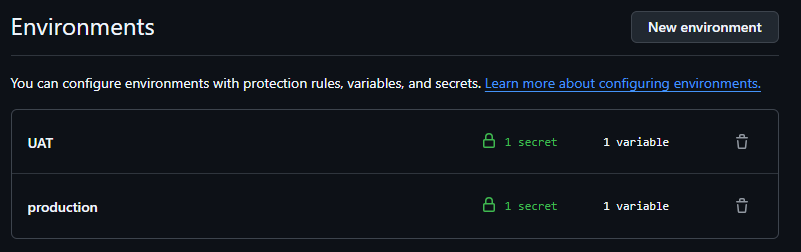
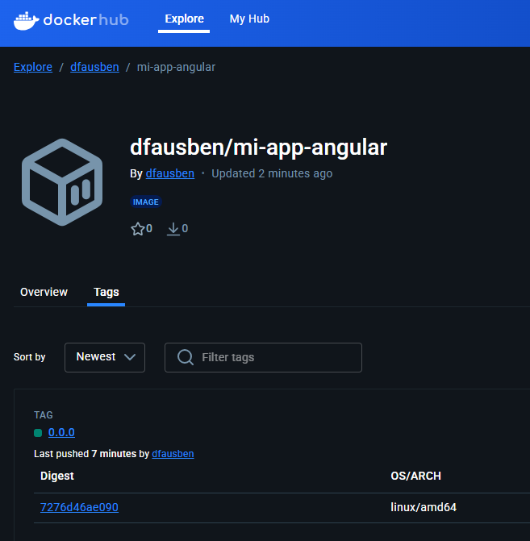
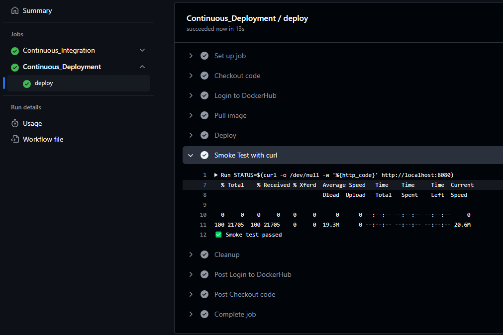
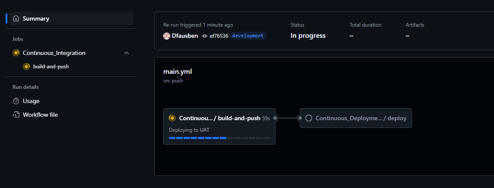

# Ejercicios de Github Actions  para iniciarse en el Mundo de DevOps

## Solución

### ¿Qué es el proceso CI/CD?

En primer lugar debemos comprender el proceso lógico que debemos seguir para una adecuada implementación de un proceso básico de CI/CD. 

Podemos considerar este proceso como una metodología que tiene como objetivo primero agilizat y automatizar procesos repetitivos, que podremos traducir en una reducción de los costes de tiempo que un proyecto de desarrollo puede presentar. Por otro lado la automatización permite mantener unos estandares y seguridades sobre el entorno de trabajo.

Comprendido los objetivos de este proceso podremos desarrollar de forma adecuada y gracias a tecnologías como Github Actions o Docker entre otras, una buena cobertura que servira como base para proyectos, permitiendo moldeabilidad y reutilización.


### Implementación del proceso mediante Github Actions

Se propone un modelo básico que simule la integración y despliegue continuo para el desarrollo sobre una imagen docker.

#### Definición de los entornos sobre el repositorio de Github

Para una correcta metodología de trabajo y para acercanos más a un caso real de ejecución de este proceso, implementaremos diferentes entornos sobre los que trabajar y condicionando los diferentes trabajos a funcionar con estos entornos según la rama para la que estemos trabajando.



#### Integración Continua (***Continuous Integration***)

Desde la parte de integración continua (CI) construiremos sobre la imagen local del repositorio, permitiendo la actualización de la imagen con los cambios realizados en archivos locales. Este proceso además de construir una imagen Docker con los archivos locales, subirá al repositorio Docker la imagen actualizada.

Para ello trabajaremos desarrollando un workflow de Github Actions enfocado en estas tareas, creamos un archivo yml con los siguientes contenidos:

````yml
# Definimos el nombre del workflow
name: CI

# Se ejecuta el workflow cuando se llama desde otro workflow
on:
  workflow_call:
    # Definimos las entradas del workflow
    inputs:
      # El ambiente es requerido y es de tipo string
      environment:
        required: true
        type: string
    # Definimos las salidas del workflow
    outputs:
      # La imagen es la salida del job build-and-push
      image:
        value: ${{ jobs.build-and-push.outputs.image }}

# Definimos el job build-and-push
jobs:
  build-and-push:
    # Se ejecuta en un entorno ubuntu-latest
    runs-on: ubuntu-latest
    # El ambiente es el que se pasa como entrada
    environment: ${{ inputs.environment }}
    # Definimos las salidas del job
    outputs:
      # La imagen es la salida del step image_out
      image: ${{ steps.image_out.outputs.IMAGE }}
    # Definimos los pasos del job
    steps:
      # Clonamos el código
      - name: Checkout code
        uses: actions/checkout@v4

      # Iniciamos sesión en DockerHub
      - name: Login to DockerHub
        uses: docker/login-action@v3
        with:
          # El usuario es el que se define en la variable DOCKER_USERNAME
          username: ${{ vars.DOCKER_USERNAME }}
          # La contraseña es el token que se define en la variable DOCKER_TOKEN
          password: ${{ secrets.DOCKER_TOKEN }}

      # Extraemos la versión del archivo package.json
      - name: Extraer versión de package.json
        run: |
          VERS=$(jq -r '.version' package.json)
          echo "VERSION=$VERS" >> $GITHUB_ENV

      # Etiquetamos la imagen con la versión
      - id: tag-image
        uses: ./.github/actions/tag-image
        with:
          # El nombre de la imagen es el que se define en la variable DOCKER_USERNAME/mi-app-angular
          image_name: ${{ vars.DOCKER_USERNAME }}/mi-app-angular
          # La versión es la que se extrae del archivo package.json
          version: $VERSION

      # Configuramos QEMU
      - name: Set up QEMU
        uses: docker/setup-qemu-action@v3

      # Configuramos Docker Buildx
      - name: Set up Docker Buildx
        uses: docker/setup-buildx-action@v3

      # Almacenamos la imagen etiquetada en la variable de entorno IMAGE
      - id: image_out
        run: echo "IMAGE=${{ steps.tag-image.outputs.tagged_image }}" >> "$GITHUB_OUTPUT"

      # Almacenamos la imagen etiquetada en la variable de entorno IMAGEV
      - id: image_env
        run: echo "IMAGEV=${{ steps.tag-image.outputs.tagged_image }}" >> "$GITHUB_ENV"

      # Construimos y subimos la imagen a DockerHub
      - name: Build and push
        uses: docker/build-push-action@v6
        with:
          # El contexto es el directorio actual
          context: .
          # Subimos la imagen a DockerHub
          push: true
          # La etiqueta es la que se almacena en la variable de entorno IMAGEV
          tags: ${{ env.IMAGEV }}
````

Definimos este workflow como reusable pues finalmente realizaremos un workflow principal que manejara la llamada de los workflows secundarios definidos como CI y CD.

##### Custom Action - Taggear la imagen de Docker

También para este workflow secundario denominado como CI, nos ayudaremos de una custom action el cual permitirá tagear de forma correcta la imagen, corrigiendo la versión con la versión obtenida del paso de extracción de la versión del archivo `package.json` del proyecto. La construcción de esta custom action se definira con los siguiente contenidos:

````yml
# Definimos el nombre del flujo de trabajo
name: "tag-image"

# Definimos las entradas (inputs) del flujo de trabajo
inputs:
  # El nombre de la imagen Docker
  image_name:
    description: El nombre de la imagen Docker
    required: true  # Este campo es obligatorio
  # La versión de la imagen
  version:
    description: La versión de la imagen
    required: true  # Este campo es obligatorio

# Definimos las salidas (outputs) del flujo de trabajo
outputs:
  # El nombre completo de la imagen (incluyendo la versión)
  tagged_image:
    description: El nombre completo de la imagen
    value: ${{ inputs.image_name }}:${{ inputs.version }}  # Concatenamos el nombre y la versión

# Definimos el comando que se ejecutará en el flujo de trabajo
runs:
  using: "composite"  # Utilizamos un comando compuesto
  steps:
    # Definimos un paso que ejecuta un comando en la shell
    - run: |
        echo "Tagging image ${{ inputs.image_name }} with version ${{ inputs.version }}"
        echo "Tagged image: ${{ inputs.image_name }}:${{ inputs.version }}"
      shell: bash  
````

Desde esta custom action comenzaremos con el manejo de variables que almacenarán información relevante para otras partes del proyecto.

##### Comprobación

Si ejecutasemos solo esta parte de la automatización CI/CD obtendremos como bien se ha declarado anteriormente la construción y publicación de la imagen al repositorio Docker.

Comprobamos que este hecho accediendo (en caso de que podamos) al susodicho repositorio.



#### Despligue Continuo (***Continuous Deployment***)

Para la parte del despliegue continuo (CD) nos ayudaremos de la imagen creada en integración continua, desplegandola en el servicio de Nginx. Esto permitirá una rápida y sencilla comprobación de la apliación permitiendo a los desarrolladores la visualización sobre el desarrollo realizado. 

Para completar este proceso deberemos definir un archivo yml que tenga los siguientes contenidos:

````yml
# Definimos el nombre del workflow
name: CD

# Se ejecuta el workflow cuando se llama desde otro workflow
on:
  workflow_call:
    # Definimos las entradas del workflow
    inputs:
      # Entorno de ejecución (requerido)
      environment:
        required: true
        type: string
      # Imagen de Docker (requerida)
      image:
        required: true
        type: string

# Definimos el trabajo "deploy"
jobs:
  deploy:
    # Se ejecuta en un entorno de Ubuntu
    runs-on: ubuntu-latest
    # Establecemos el entorno de ejecución
    environment: ${{ inputs.environment }}
    # Establecemos la variable de entorno "IMAGE"
    env:
      IMAGE: ${{ inputs.image }}
    # Definimos los pasos del trabajo
    steps:
      # Paso 1: Descargamos el código del repositorio
      - name: Checkout code
        uses: actions/checkout@v4

      # Paso 2: Iniciamos sesión en DockerHub
      - name: Login to DockerHub
        uses: docker/login-action@v3
        with:
          # Utilizamos las variables de entorno para autenticarnos
          username: ${{ vars.DOCKER_USERNAME }}
          password: ${{ secrets.DOCKER_TOKEN }}

      # Paso 3: Descargamos la imagen de Docker
      - name: Pull image
        run: |
          # Utilizamos el comando "docker pull" para descargar la imagen
          docker pull ${IMAGE}

      # Paso 4: Ejecutamos la imagen de Docker
      - name: Deploy
        run: |
          # Utilizamos el comando "docker run" para ejecutar la imagen
          docker run -d --name dfauben-nginx -p 8080:8080 ${IMAGE}

      # Paso 5: Realizamos una prueba de humo con curl
      - name: Smoke Test with curl
        run: |
          # Utilizamos el comando "curl" para realizar una solicitud HTTP
          STATUS=$(curl -o /dev/null -w '%{http_code}' http://localhost:8080)
          # Verificamos si la solicitud fue exitosa (código 200)
          [ "$STATUS" -eq 200 ] && echo "✅ Smoke test passed" || (echo "❌ Got $STATUS" && exit 1)

      # Paso 6: Limpiamos el contenedor (siempre se ejecuta)
      - name: Cleanup
        if: always()
        run: docker rm -f dfauben-nginx
````

Seguimos observando que en el método de trabajo utiliza el traspaso de variables para el correcto manejo de información relativa al proyecto, desde este workflow utilizaremos una variable con el nombre actualizado y correcto sobre la imagen de Docker que hemos creado previamente, junto a la comprobación mediante un test ***Smoke*** que nos tramite la confirmación de que existe un despligue exitoso sobre la dirección prevista.



##### Workflow Principal

He considerado para una correcta estructuración realizar un workflow principal que llame a los workflows secundarios de CI y CD, definiendo además la dependencia de uno sobre otro y permitiendo el correcto traspaso de variables entre workflows.

Lo definimos de la siguiente forma:

````yml
# Definimos el nombre del workflow
name: Angular app CI/CD

# Se ejecuta el workflow al hacer push en las ramas main o development
on:
  push:
    branches:
      - main
      - development

# Definimos los jobs que se ejecutarán en el workflow
jobs:

  # Job de Integración Continua
  Continuous_Integration:
    # Utilizamos el archivo ci.yml en la carpeta .github/workflows
    uses: ./.github/workflows/ci.yml
    # Heredamos los secretos del repositorio
    secrets: inherit
    # Pasamos el entorno como parámetro al job
    with:
      # Determinamos el entorno según la rama en la que se ejecuta el workflow
      environment: ${{ github.ref_name == 'main' && 'production' || (github.ref_name == 'development' && 'UAT' || 'UAT') }}

  # Job de Despliegue Continuo
  Continuous_Deployment:
    # Este job depende del job de Integración Continua
    needs: Continuous_Integration
    # Utilizamos el archivo cd.yml en la carpeta .github/workflows
    uses: ./.github/workflows/cd.yml
    # Heredamos los secretos del repositorio
    secrets: inherit
    # Pasamos el entorno y la imagen como parámetros al job
    with:
      # Determinamos el entorno según la rama en la que se ejecuta el workflow
      environment: ${{ github.ref_name == 'main' && 'production' || (github.ref_name == 'development' && 'UAT' || 'UAT') }}
      # Obtenemos la imagen generada en el job de Integración Continua
      image: ${{ needs.Continuous_Integration.outputs.image }}
````

Ahora solo nos queda simplemente comprobar a través del trigger definido sobre este workflow para comenzar el proceso de automatización.




#### Conclusión

Tras la realización del proyecto podemos concluir con las diferentes ventajas que nos aporta procesos de automatización como lo es CI/CD y el valor que aporta para los proyectos de desarrollo. Nos acerca a comprender el motivo que impulsa el estudio de estas tecnologías y la importancia del correcto uso para las empresas y servicios.

#### Agradecimientos

Agradecer a los diferentes compañeros que aportaron para el correcto funcionamiento del ejercicio:
 - [Leandro Carbajo Mendez](https://github.com/lcarbajomendez)

